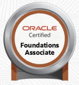
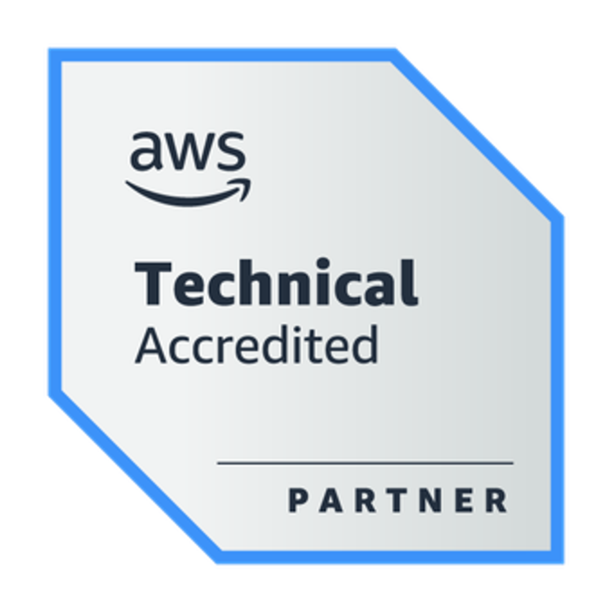

# Certificações

Reconhecimento oficial de que alguém tem habilidades em uma área específica.

---

## Oracle Cloud Infrastructure - AI Certified Foundations Associate

    

        

            
        

    

    

        <strong><li>Data de Obtenção: </strong>05/11/2023
        <strong><li>Data de Expiração: </strong>05/11/2024
        <strong><li>Empresa: </strong><a href="https://www.oracle.com/">Oracle</a>
    

---

## AI-Assisted Certified Professional

    

        

            
        

    

    

        <strong><li>Data de Obtenção: </strong>26/07/2023
        <strong><li>Data de Expiração: </strong>26/07/2024
        <strong><li>Empresa: </strong><a href="https://compass.uol/">Compass.uol</a>
    

---

## Python para Cibersegurança Associado

    

        

            
        

    

    

        <strong><li>Data de Obtenção: </strong>17/01/2023
        <strong><li>Data de Expiração: </strong>17/01/2024
        <strong><li>Empresa: </strong><a href="https://ibsec.com.br/">IBSEC - Instituto Brasileiro de Cibersegurança</a>
    

---

## Oracle Cloud Infrastructure - Foundations Associate 2021

    

        

            
        

    

    

        <strong><li>Data de Obtenção: </strong>15/02/2022
        <strong><li>Data de Expiração: </strong>15/08/2023
        <strong><li>Empresa: </strong><a href="https://www.oracle.com/">Oracle</a>
    

---

# Acreditações

Avaliação que certifica que uma instituição ou programa atende a padrões de qualidade.

---

## AWS Partner: Cloud Economics Accreditation

    

        

            
        

    

    

        <strong><li>Data de Obtenção: </strong>25/03/2022
        <strong><li>Empresa: </strong><a href="https://aws.amazon.com/">AWS</a>
    

---

## AWS Partner: Accreditation (Business)

    

        

            
        

    

    

        <strong><li>Data de Obtenção: </strong>04/03/2022
        <strong><li>Empresa: </strong><a href="https://aws.amazon.com/">AWS</a>
    

---

## AWS Partner: Accreditation (Technical)

    

        

            
        

    

    

        <strong><li>Data de Obtenção: </strong>09/02/2022
        <strong><li>Empresa: </strong><a href="https://aws.amazon.com/">AWS</a>
    

